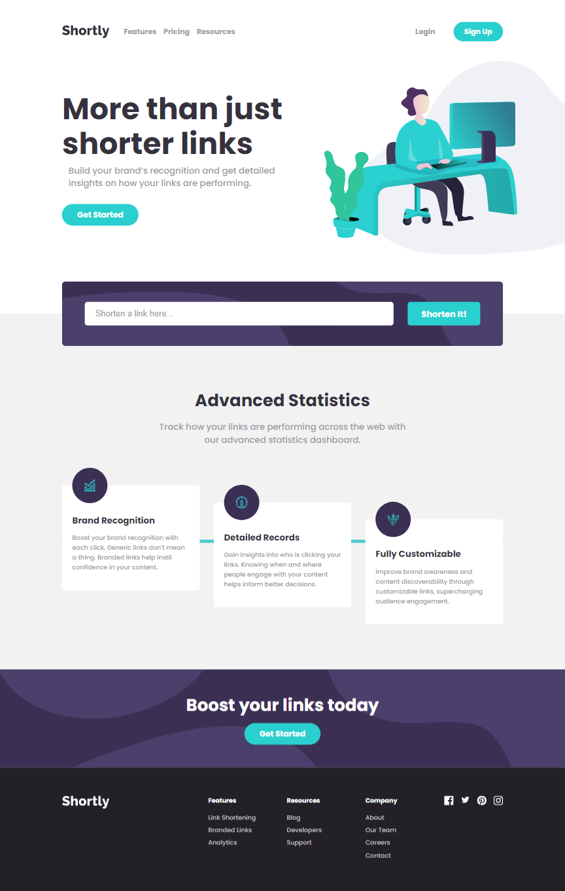

# Frontend Mentor - Shortly URL shortening API Challenge solution

This is a solution to the [Shortly URL shortening API Challenge challenge on Frontend Mentor](https://www.frontendmentor.io/challenges/url-shortening-api-landing-page-2ce3ob-G). Frontend Mentor challenges help you improve your coding skills by building realistic projects.

## Table of contents

- [Overview](#overview)
  - [The challenge](#the-challenge)
  - [Screenshot](#screenshot)
  - [Links](#links)
- [My process](#my-process)
  - [Built with](#built-with)
  - [What I learned](#what-i-learned)
- [Author](#author)

**Note: Delete this note and update the table of contents based on what sections you keep.**

## Overview

### The challenge

Users should be able to:

- View the optimal layout for the site depending on their device's screen size
- Shorten any valid URL
- See a list of their shortened links, even after refreshing the browser
- Copy the shortened link to their clipboard in a single click
- Receive an error message when the `form` is submitted if:
  - The `input` field is empty

### Screenshot



### Links

- Solution URL: [https://www.frontendmentor.io/solutions/url-shortening-api-B9pUCkxjwW](https://www.frontendmentor.io/solutions/url-shortening-api-B9pUCkxjwW)
- Live Site URL: [https://onlymanu-url-shorten.vercel.app](https://onlymanu-url-shorten.vercel.app)

## My process

### Built with

- Semantic HTML5 markup
- CSS custom properties
- Flexbox
- CSS Grid
- Mobile-first workflow
- Typescript
- [React](https://reactjs.org/) - JS library
- [Next.js](https://nextjs.org/) - React framework

### What I learned

Copy a text to clipboard

```tsx
navigator.clipboard.writeText(link);
```

## Author

- Website - [https://onlymanu.vercel.app](https://onlymanu.vercel.app)
- Frontend Mentor - [@OnlyManu](https://www.frontendmentor.io/profile/OnlyManu)
